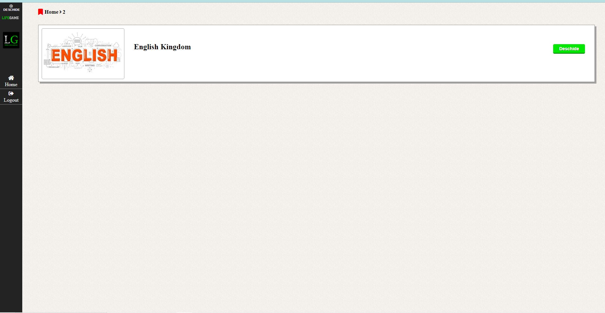
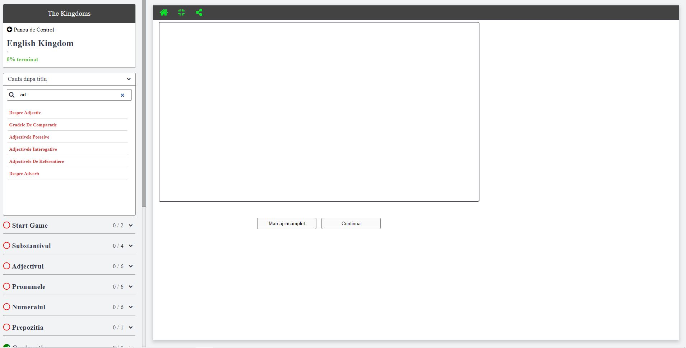

# spiderlink-project
Proiect web pentru gestionarea si salvarea link-uri utile. Posibilitatea de a crea playlisturi de link-uri sau cursuri. Gestionarea link-urilor pe categori si subcategori. Posibilitatea de a cauta un diferite curs / playlist dar si de a cauta un link/sectiune anume in cadrul cursului/playlistului. 

